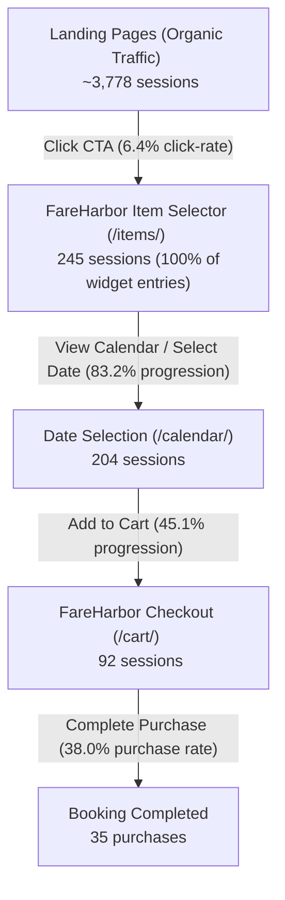

# Traffic-to-Conversion Funnel Analysis

**Date:** 2026-06-12  
**Source Data:** GA4 (30-day and 90-day pulls for Property `289642224`)  

---

## 1. Funnel Overview (30-day snapshot)

Below is a representation of the site-wide organic traffic funnel. Once users reach the checkout stage, conversions are strong, but there are massive drop-offs between landing on key pages and initiating a booking.

### Key Funnel Statistics:
* **Landing Page to Booking Widget Entry Rate**: **6.4%** (indicates weak or misaligned CTAs on landing pages).
* **Booking Widget Entry to Date Selection**: **83.2%** (strong interest, calendar loads correctly).
* **Date Selection to Checkout Cart**: **45.1%** (decent, but shows friction in pricing/timing availability).
* **Cart Page to Purchase Conversion Rate**: **38.0%** (excellent, confirming that checkout page friction is minimal once intent is locked).
* **Overall Session-to-Booking Conversion Rate**: **0.93%** (low compared to industry averages of 2-3% for activities).

---

## 2. Top Landing Page Performance (Last 30 Days)

The table below maps the top landing pages by organic sessions, detailing user engagement (bounce rate, average session duration) and direct purchase conversions recorded in GA4 over the last 90 days.

| # | Landing Page Path | 30D Sessions | Bounce Rate | Avg. Duration | 90D Purchases | Conv. Rate (Est.) | Status & Issues |
|---|---|---|---|---|---|---|---|
| 1 | `/` | 873 | 45.7% | 118.6s | 7 | 0.27% | 🔴 **Critical Leak**: Generic header booking links; lack of direct product CTAs. |
| 2 | `/activities/sharks-cove-self-guided-snorkel/` | 411 | 42.6% | 131.9s | 1 | 0.08% | 🚨 **Severe Friction**: Kailua storefront gear pickup required for North Shore activity. |
| 3 | `/oahu-equipment-rentals/chinamans-hat-kayak-rentals/` | 254 | 38.6% | 121.8s | 8 | 1.05% | 🟢 **Healthy**: Direct product match, clear local pickup instructions. |
| 4 | `/activities/` | 203 | 10.8% | 138.6s | 1 | 0.16% | 🟡 **Weak**: High engagement but low booking initiation. |
| 5 | `/oahu-kayaking-and-beach-adventures/kaneohe-sandbar-kayak-experience/` | 181 | 23.2% | 156.2s | 5 | 0.92% | 🟢 **Healthy**: High engagement, good intent conversion. |
| 6 | `/oahu-equipment-rentals/` | 171 | 19.3% | 107.5s | 1 | 0.19% | 🟡 **Weak**: Broad listing page, users drop off without selecting a specific product. |
| 7 | `/rentals/oahu-tandem-kayak-rentals/` | 146 | 17.8% | 122.1s | 8 | 1.83% | 🟢 **Top Performer**: Strong commercial intent, direct booking alignment. |
| 8 | `/rentals/oahu-tandem-kayak-rentals/kailua-kayak-rentals/` | 103 | 36.9% | 121.4s | 3 | 0.97% | 🟢 **Healthy**: Kailua local rentals. |
| 9 | `/activities/kahana-rainforest-river-oahu-kayak-tour/` | 91 | 39.6% | 118.7s | 0 | 0.00% | 🔴 **Friction**: Underperforming river kayak tour page; weak CTA hierarchy. |
| 10 | `/oahu-kayaking-and-beach-adventures/kaneohe-sandbar-self-guided-kayak-adventure/` | 72 | 16.7% | 102.8s | 0 | 0.00% | 🟡 **Weak**: Informational content, missing direct rental path. |
| 11 | `/activities/chinamans-hat-self-guided-oahu-kayak-tour/` | 71 | 25.4% | 127.6s | 0 | 0.00% | 🟡 **Weak**: Tour explanation page, needs simplified booking CTA. |
| 12 | `/rentals/oahu-beach-chair-rentals/` | 71 | 32.4% | 67.6s | 5 | 2.35% | 🟢 **Excellent**: Micro-rental page converting well relative to traffic. |
| 13 | `/rentals/oahu-stand-up-paddle-board-rentals-sup-hire/` | 65 | 43.1% | 60.8s | 0 | 0.00% | 🔴 **Friction**: Needs bottom-sticky booking bar for mobile viewports. |
| 14 | `/rentals/kailua-beach-bike-rentals/` | 64 | 23.4% | 105.5s | 0 | 0.00% | 🟡 **Weak**: Electric bike page, weak visual CTA and pricing layout. |
| 15 | `/rentals/oahu-tandem-kayak-rentals/mokolii-kayak-rentals/` | 61 | 29.5% | 112.1s | 0 | 0.00% | 🟡 **Weak**: Duplicate intent with Chinaman's Hat rentals; needs consolidation. |
| 16 | `/oahu-equipment-rentals/how-to-transport-kayaks-and-sups-from-our-shop-in-kailua-to-the-beach/` | 58 | 48.3% | 129.6s | 0 | 0.00% | 🟡 **Weak**: Informational guide page, high bounce, no conversions. |
| 17 | `/activities/chinamans-hat-oahu-kayak-tours/` | 54 | 48.1% | 138.2s | 1 | 0.62% | 🟢 **Healthy**: Converts well relative to traffic volume. |
| 18 | `/activities/kailua-bay-mokulua-island-self-guided-kayak-tour/` | 54 | 20.4% | 138.9s | 3 | 1.85% | 🟢 **Healthy**: High duration, good local search conversion. |
| 19 | `/rentals/oahu-snorkel-mask-and-fin-rentals/` | 48 | 29.2% | 90.3s | 0 | 0.00% | 🔴 **Friction**: Requires Kailua shop pickup for North Shore snorkeling. |
| 20 | `/activities/popoia-island-and-kailua-bay-guided-kayak-tour/` | 47 | 29.8% | 129.5s | 0 | 0.00% | 🟡 **Weak**: High-value guided tour, but booking CTA is buried below reviews. |

---

## 3. High-Traffic / Low-Conversion Leak Analysis

### 1. Sharks Cove Snorkeling (`/activities/sharks-cove-self-guided-snorkel/`)
* **The Data**: 405 sessions in 30 days, 131.5s average engagement, but **0 purchases** in 90 days.
* **The Cause**: The page sells a "Self-Guided Snorkel Tour" for $38–$49. However, the text states: *"You will meet us at our Kailua storefront to pickup the gear, perfect if you are driving up from Honolulu."* Sharks Cove is on the North Shore—an hour's drive from Kailua. Users realize they must pick up snorkel gear in Kailua and transport it 30+ miles to Snorkel at Pupukea. They bounce and rent from local North Shore shops instead.
* **The Fix**: Align CTA to rent gear locally or offer delivery. Alternatively, convert the page to a pure affiliate/lead-generation play or change the offer to a guided tour that transports gear.

### 2. The Homepage (`/`)
* **The Data**: 859 sessions in 30 days, 45.6% bounce, but only **7 conversions** in 90 days.
* **The Cause**: The page acts as a generic portal. The primary CTA buttons are "Book Online" and "Rent Kayaks & Beach Gear", which load the entire FareHarbor catalog. When faced with 15+ options in a calendar overlay, users suffer from decision paralysis and leave.
* **The Fix**: Re-architect the homepage hero to feature the top 3 best-selling products (Chinaman's Hat Kayak Rentals, Kaneohe Sandbar Kayak Experience, and Kailua Tandem Kayak Rentals) with direct-booking buttons that deep-link to those specific FareHarbor items.

### 3. Rainforest River Kayak Tour (`/activities/kahana-rainforest-river-oahu-kayak-tour/`)
* **The Data**: 90 sessions, 40.0% bounce, 119.8s duration, **0 conversions** in 90 days.
* **The Cause**: The booking widget is buried below 3 screens of text, and the page lacks trust signals (no reviews or ratings featured).
* **The Fix**: Pull the pricing and booking calendar button above the fold. Embed a "What's Included" card and feature customer reviews specifically for the Kahana River tour.
