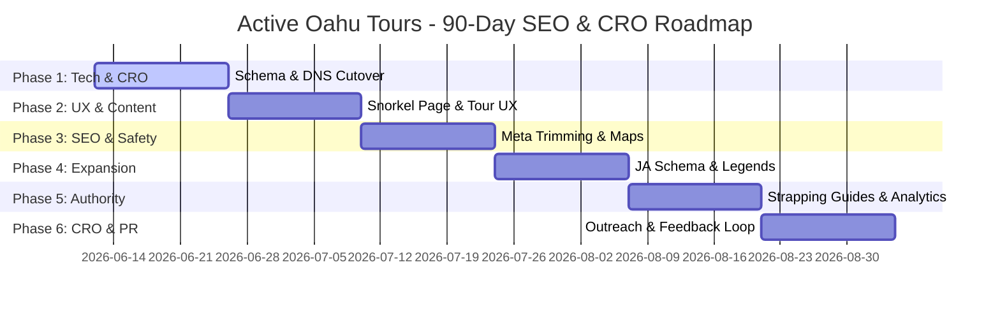

# Active Oahu Tours — 90-Day Executable Roadmap
**Date:** June 12, 2026  
**Author:** Antigravity (agent:fred)  
**Initiative:** GRO-1211 (Roadmap Implementation)  

---

## 1. Roadmap Overview

This 90-day roadmap outlines the follow-up tasks derived from the **AGY Strategic Questions Audit (GRO-1183)**. These are concrete, executable tasks that do not require business strategy decisions and are ready for implementation. They are grouped into 6 bi-weekly phases prioritized by impact and technical dependency.

---

## 2. Roadmap Phases & Tasks

### Phase 1: Weeks 1-2 — Immediate Technical & Conversion Fixes (P0)

| ID | Task | Description | Effort | Depends On | Owner | Target Ticket |
| :--- | :--- | :--- | :--- | :--- | :--- | :--- |
| **CF1.1** | Astro DNS Cutover (Resolve 404s) | Execute the live cutover to the stable Astro site mirror to eliminate server-side 404 error leaks on high-intent pages like `/sharks-cove-snorkeling/`. | 1 day | None | Ned | `GRO-1195` |
| **DG1.1** | FareHarbor GA4 Conversion Tracking | Configure cross-domain ecommerce tracking between activeoahutours.com and fareharbor.com to measure revenue attribution per page. | 2 days | CF1.1 | Ned | `GRO-1214` |
| **Q1.1** | Inject Rich Snippet Schema into P0 Top-20 Pages | Inject structured JSON-LD schema markup into the top 20 English transactional pages to boost organic CTR. | 2 days | None | Kai | `GRO-1184` |
| **Q1.3** | Fix 7 Orphaned High-Value Tour & Guide Pages | Add internal links from site navigation, sitemaps, and relevant blog posts to connect the 7 orphaned pages and distribute link equity. | 1 day | None | Kai | `GRO-1186` |
| **Q1.4** | Resolve Broken `/.html` Crawl Errors | Remove outdated `/.html` page suffixes from internal links and sitemaps on Mokulua tour pages to eliminate 404 crawler errors. | 1 day | None | Kai | `GRO-1186` |

### Phase 2: Weeks 3-4 — Immediate Content & UX Optimizations (P0/P1)

| ID | Task | Description | Effort | Depends On | Owner | Target Ticket |
| :--- | :--- | :--- | :--- | :--- | :--- | :--- |
| **Q2.1** | Create Snorkel Rentals Landing Page | Design and publish a commercial landing page targeting Windward snorkel rentals to capture traffic currently dominated by Kailua Beach Adventures. | 2 days | None | Kai | `GRO-1189` |
| **CF1.2** | Optimize Checkout Copy for Car-Strapping Friction | Update checkout descriptions and product copy to set expectations about storefront pickup and car-strapping logistics, easing buyer anxiety. | 1 day | None | Kai | `GRO-1196` |
| **GV1.1** | Redesign Tour Page UX Layout Above-the-Fold | Reorganize tour pages to place vital booking logistics (launch location, parking, rules, fitness levels) in the primary scroll viewport. | 2 days | None | Kai | `GRO-1203` |
| **GV1.2** | Kaneohe Sandbar Tide Widget Integration | Embed a live tide chart forecast on the Kaneohe Sandbar rentals page, allowing guests to align bookings with low tide window exposures. | 1 day | GV1.1 | Ned | `GRO-1204` |

### Phase 3: Weeks 5-6 — Technical SEO & Safety Enhancements (P1)

| ID | Task | Description | Effort | Depends On | Owner | Target Ticket |
| :--- | :--- | :--- | :--- | :--- | :--- | :--- |
| **Q1.5** | Trim Overlong Title & Meta Tags | Shorten the 31 page titles and 25 meta descriptions that currently exceed Google search display limits, preventing CTR truncation. | 2 days | None | Kai | `GRO-1187` |
| **GV1.3** | Deploy Safety Trust Signals Section | Add certification badges, lifeguard proximity details, and capsize recovery guidelines on all water activities pages to reassure first-time paddlers. | 1 day | None | Kai | `GRO-1205` |
| **GV1.4** | Integrate Cancellation & Weather Policy Sections | Place transparent weather guidelines and easy-to-understand cancellation policies on tour pages to prevent disputes during high wind days. | 1 day | GV1.3 | Kai | `GRO-1205` |
| **GV1.5** | Build Launch Site Amenity Map Guides | Add visual guides showing parking, restrooms, showers, and shaded areas at Kualoa Regional Park and He'eia Kea Pier. | 2 days | None | Kai | `GRO-1206` |
| **GV1.6** | Configure Pre-Trip Footwear Warnings in Emails | Update pre-trip automated emails with clear warnings regarding bouldering hazards on Chinaman's Hat and sharp coral at the Sandbar. | 1 day | None | Kai | `GRO-1207` |
| **GV1.7** | Optimize Post-Booking Storefront Check-in Instructions | Clarify post-booking check-in instructions to ensure guests drive to the Kailua storefront first instead of launching directly. | 1 day | GV1.6 | Kai | `GRO-1207` |

### Phase 4: Weeks 7-8 — Secondary Content & Schema (P1/P2)

| ID | Task | Description | Effort | Depends On | Owner | Target Ticket |
| :--- | :--- | :--- | :--- | :--- | :--- | :--- |
| **Q2.3** | Rebuild Standup Paddleboard Landing Page | Rewrite content and update layout on the underperforming standup paddleboard rental page to push rankings from #15 into the top 10. | 2 days | None | Kai | `GRO-1191` |
| **Q1.2** | Inject Schema into 83 Japanese Mirror Pages | Localize and deploy schema markup for all 83 Japanese pages to capture rich search features in the Japanese tourist market. | 2 days | Q1.1 | Ned | `GRO-1185` |
| **AU1.3** | Integrate Mokoli'i Legend Cultural Copy | Add Windward cultural lore—specifically the legend of Mokoli'i island and the goddess Hi'iaka—to build local authority (EEAT). | 1 day | None | Kai | `GRO-1210` |
| **AU1.4** | Integrate Kahana Valley Stewardship Content | Detail the history of Kahana Valley and its resident community stewards to add depth and authority to North Shore guide pages. | 1 day | None | Kai | `GRO-1210` |
| **AU1.5** | Inject Kawela Bay Freshwater Springs Lore | Describe traditional watershed management (Ahupua'a) and the significance of 'wai' for Kawela Bay freshwater guides. | 1 day | None | Kai | `GRO-1210` |
| **AU1.6** | Integrate Environmental & Wildlife Compliance Sections | Detail DLNR wildlife protection rules, including shearwater ground burrow warnings, to highlight eco-responsible operations. | 1 day | None | Kai | `GRO-1211` |

### Phase 5: Weeks 9-10 — Authority & How-To Guides (P1/P2)

| ID | Task | Description | Effort | Depends On | Owner | Target Ticket |
| :--- | :--- | :--- | :--- | :--- | :--- | :--- |
| **Q3.1** | Local Storytelling Integration (Abigail's Drafts) | Incorporate local narrative safety tips, history, and rules from Abigail's drafts into Chinaman's Hat and Kaneohe Sandbar pages. | 2 days | None | Kai | `GRO-1192` |
| **AU1.7** | Create How-To Kayak Vehicle Strapping Guide | Produce a step-by-step strapping guide (images/text) to demonstrate hands-on expertise and prepare storefront pickup guests. | 2 days | None | Kai | `GRO-1212` |
| **DG1.2** | Micro-Conversions Tag Setup (Directions/Calls) | Implement Google Tag Manager tracking for 'Get Directions' and phone call clicks on mobile devices to evaluate local search value. | 1 day | DG1.1 | Ned | `GRO-1215` |
| **DG1.3** | User Behavior Analytics Integration (Heatmaps) | Install Microsoft Clarity on the top 20 pages to monitor mobile user scroll depths and locate conversion bottlenecks. | 1 day | None | Ned | `GRO-1216` |

### Phase 6: Weeks 11-12 — CRO, PR & Analytics Automation (P2)

| ID | Task | Description | Effort | Depends On | Owner | Target Ticket |
| :--- | :--- | :--- | :--- | :--- | :--- | :--- |
| **Q3.2** | Local PR & Backlink Campaign | Execute link outreach targeting Oahu tourism, accommodation, and community directories to close the backlink gap against KBA. | 3 days | None | Kai | `GRO-1193` |
| **CF1.6** | FareHarbor Checkout Upsell Setup | Add a snorkel gear bundle add-on directly to the booking checkout flow for Kailua and Chinaman's Hat rentals to boost AOV. | 1 day | Q2.1 | Ned | `GRO-1200` |
| **CF1.8** | Configure Post-Trip Email Marketing Automation | Create automated email sequences triggered after guest trips to request reviews and offer discount codes for repeat visits. | 2 days | None | Kai | `GRO-1202` |
| **DG1.4** | CTR Optimization Audit (>1k Impressions, <2% CTR) | Analyze GSC queries with high impressions but poor CTR, adjusting title tags and target keywords to recapture search volume. | 2 days | DG1.1 | Ned | `GRO-1217` |
| **DG1.5** | Competitor Keyword Sweep Update | Run a fresh Ubersuggest API crawl to capture keyword rankings and backlink profiles missed during initial rate-limiting sweeps. | 1 day | None | Ned | `GRO-1218` |
| **DG1.6** | Competitive Price Scraping Setup | Build a light price-monitoring script to track competitor rental adjustments during peak summer and winter seasons. | 2 days | None | Ned | `GRO-1219` |
| **DG1.7** | Establish Customer Feedback & Survey Loops | Set up a feedback loop aggregating post-trip reviews and customer support logs to feed directly into content updates. | 1 day | CF1.8 | Kai | `GRO-1220` |
| **Q4.1** | On-Page SEO Tuning (Striking Distance Keywords) | Tune content, schema, and linking on pages ranking in positions #4-10 (e.g. 'kayak tour oahu') to push them into the top 3. | 2 days | None | Kai | `GRO-1194` |
| **Q1.6** | Thin Content Indexation Cleanup (Paginated Archives) | Deploy `noindex` tags across paginated blog and activity archive pages to prevent search engine thin-content penalties. | 1 day | None | Kai | `GRO-1188` |

---

## 3. Immediate Next Actions (This Week)
1. **[Michael decision]** Review the **Strategic Decisions Document** (`decision-document-2026-06-12.md`), specifically Pricing Strategy and duration restructuring.
2. **[Ned execute]** Complete Astro DNS Cutover (`CF1.1`) to resolve 404 leakage immediately.
3. **[Kai execute]** Begin P0 schema injection on the top 20 English pages (`Q1.1`).
4. **[Fred audit]** Verify tracking setups once GA4 FareHarbor integration goes live.

