# Topical Authority & Content Cluster Map — Active Oahu Tours

**Date:** 2026-06-11  
**Initiative:** 01 — Topical Authority & Content Clusters (GRO-1178)  
**Output dir:** `/home/ubuntu/work/active-oahu-static/site/_seo/reports/01-topical-authority/`  
**Focus Domain:** activeoahutours.com

---

## Executive Summary

To outrank primary competitor Kailua Beach Adventures (KBA, DA 32) and establish definitive topical authority for Google, Active Oahu Tours (AOT, DA 26) must transition from disjointed landing pages to a highly structured **Hub-and-Spoke (Pillar-Cluster) architecture**. 

Currently, the site has **249 HTML pages** (166 English + 83 Japanese mirrors). While organic search fundamentals are strong, the site suffer from two structural issues:
1. **Keyword Cannibalization:** Multiple competing pages target Kailua kayak rentals.
2. **Equity Leakage:** Key informational pages (e.g., Chinaman's Hat complete guide) are orphaned (0 internal links).

This report outlines **6 Core Topic Clusters** (4 Geographic, 2 Product-focused) that map all 249 pages. We also provide a **3-Month Content Calendar** to capture high-value search intent—specifically targeting "snorkel rental oahu" (our largest commercial gap) and launching a new Kawela Bay tour product.


---

## 1. Topical Architecture Map

We have structured the site's pages into **6 distinct clusters**. The Japanese mirror pages (`ja/`) follow this structure 1-to-1.

```mermaid
graph TD
    classDef money fill:#e0f2fe,stroke:#0284c7,stroke-width:2px;
    classDef info fill:#f0fdf4,stroke:#16a34a,stroke-width:1px;
    classDef gap fill:#fef2f2,stroke:#dc2626,stroke-width:2px,stroke-dasharray: 5 5;

    P_Kailua["Pillar: /kayak-rentals/<br>(Oahu Kayak Rentals)"]:::money
    P_Mokolii["Pillar: /activities/chinamans-hat-self-guided-oahu-kayak-tour/<br>(Chinaman's Hat Tour)"]:::money
    P_Kaneohe["Pillar: /activities/kaneohe-sandbar-kayak-rentals/<br>(Kaneohe Sandbar Rentals)"]:::money
    P_Kahana["Pillar: /activities/kahana-rainforest-river-oahu-kayak-tour/<br>(Kahana River Tour)"]:::money
    P_Snorkel["Pillar: /beach-gear-rentals/<br>(Beach Gear & Snorkeling)"]:::money
    P_Ebike["Pillar: /electric-bike-rentals/<br>(E-Bike Rentals)"]:::money

    %% Gaps
    G_Snorkel["Gap Spoke: /rentals/snorkel-gear-rentals/"]:::gap
    G_Kawela["Gap Spoke: /activities/kawela-bay-self-guided-kayak-tour/"]:::gap

    %% Spokes
    S_K1["Spoke: /activities/kailua-kayak-twin-islands-guided-tour/"]:::info
    S_K2["Spoke: /rentals/oahu-tandem-kayak-rentals/kailua-kayak-rentals/"]:::money
    S_K3["Spoke: /guides/lanikai-beach/"]:::info
    
    S_M1["Spoke: /activities/chinamans-hat-kayak-complete-self-guided-tour-guide/"]:::info
    S_M2["Spoke: /chinamans-hat-tide-guide/"]:::info

    S_Sand1["Spoke: /activities/kaneohe-sandbar-kayak-ultimate-guide/"]:::info
    S_Sand2["Spoke: /kaneohe-sandbar-tide-guide/"]:::info

    S_River1["Spoke: /oahu-kayaking-and-beach-adventures/kahana-river-kayak-adventure/"]:::info

    S_Snorkel1["Spoke: /activities/sharks-cove-self-guided-snorkel/"]:::info
    S_Snorkel2["Spoke: /sharks-cove-snorkeling-guide/"]:::info

    P_Kailua --> S_K1
    P_Kailua --> S_K2
    P_Kailua --> S_K3

    P_Mokolii --> S_M1
    P_Mokolii --> S_M2
    P_Mokolii --> G_Kawela

    P_Kaneohe --> S_Sand1
    P_Kaneohe --> S_Sand2

    P_Kahana --> S_River1

    P_Snorkel --> S_Snorkel1
    P_Snorkel --> S_Snorkel2
    P_Snorkel --> G_Snorkel

    P_Ebike --> P_Kailua
```



---

## 2. Topic Cluster Breakdowns

### Cluster 1: Kailua Bay & Mokulua Islands Kayaking (Windward Oahu)
*   **Commercial Intent:** Extremely high search volume and high competition. Targets tourists looking to kayak to the Mokulua Islands (Twin Islands) or Lanikai Beach.
*   **Pillar Page:** `/kayak-rentals/index.html` (Overall Kayak Rental Hub)
*   **Sub-Pillar (Money Page):** `/activities/kailua-bay-mokulua-island-self-guided-kayak-tour/index.html`
*   **Supporting Spoke Pages (15 EN + 15 JA):**
    *   `/activities/kailua-kayak-twin-islands-guided-tour/index.html` (Guided Tour Spoke)
    *   `/activities/popoia-island-and-kailua-bay-guided-kayak-tour/index.html` (Flat Island Spoke)
    *   `/rentals/oahu-tandem-kayak-rentals/kailua-kayak-rentals/index.html` (Kailua Tandem Spoke)
    *   `/oahu-kayaking-and-beach-adventures/mokulua-islands-self-guided-kayak-adventure/index.html` (Blog Spoke)
    *   `/oahu-kayaking-and-beach-adventures/popoia-island-kayaking-adventure/index.html` (Blog Spoke)
    *   `/guides/kailua-beach-park/index.html` (Local Guide Spoke)
    *   `/guides/lanikai-beach/index.html` (Local Guide Spoke)
    *   `/kailua-town-history/index.html` (Supporting Spoke)
    *   `/oahu-equipment-rentals/how-to-transport-kayaks-and-sups-from-our-shop-in-kailua-to-the-beach/index.html` (Logistics Spoke)
    *   `ja/` mirror equivalents for all above spokes.
*   **Cannibalization Issues (Urgent):** 
    *   `/kailua-kayak/index.html` and `/kayak-kailua/index.html` are duplicate landing pages that dilute the authority of `/rentals/oahu-tandem-kayak-rentals/kailua-kayak-rentals/index.html`.
    *   *Action:* Set canonical tags on `/kailua-kayak/` and `/kayak-kailua/` pointing to `/rentals/oahu-tandem-kayak-rentals/kailua-kayak-rentals/index.html`, and eventually 301 redirect them to consolidate link juice.
*   **Internal Linking Rules:** 
    *   All blog and beach guides (Lanikai, Kailua Beach Park) must link to the self-guided tour money page with descriptive anchor text (e.g., "[Mokulua Islands self-guided kayak tour](file:///activities/kailua-bay-mokulua-island-self-guided-kayak-tour/index.html)").

---

### Cluster 2: Chinaman's Hat (Mokoliʻi Islet) Kayaking & Hiking
*   **Commercial Intent:** High authority defense. AOT is currently #1 for "chinamans hat kayak", and must defend against KBA.
*   **Pillar Page:** `/activities/chinamans-hat-self-guided-oahu-kayak-tour/index.html` (Money Page)
*   **Supporting Spoke Pages (11 EN + 11 JA):**
    *   `/activities/chinamans-hat-kayak-complete-self-guided-tour-guide/index.html` (Informational Spoke — **Orphan Fix**)
    *   `/activities/chinamans-hat-kayak-rentals/index.html` (Transactional Rental Spoke)
    *   `/chinamans-hat-tide-guide/index.html` / `/guides/chinamans-hat-tide-guide/index.html` (Safety Spoke)
    *   `/chinamans-hat/index.html` / `/mokolii/index.html` (Landing Spokes)
    *   `/faq/faq-chinamans-hat-kayak-hike/index.html` (FAQ Spoke)
    *   `/rentals/oahu-tandem-kayak-rentals/mokolii-kayak-rentals/index.html` (Product Spoke)
    *   `/oahu-kayaking-and-beach-adventures/chinamans-hat-kayak-adventure/index.html` (Blog Spoke)
    *   `/oahu-hawaii-kayaking-guide/renting-a-kayak-and-paddling-to-mokolii-island-on-oahu/index.html` (Blog Spoke)
*   **Orphan Fix:** `/activities/chinamans-hat-kayak-complete-self-guided-tour-guide/` must be linked directly from `/activities/chinamans-hat-self-guided-oahu-kayak-tour/index.html` (as a "Detailed Route Guide" callout) and from `/rentals/oahu-tandem-kayak-rentals/mokolii-kayak-rentals/index.html`.
*   **Abigail Content Insertion:**
    *   *Mokoliʻi Legend:* Insert a "Cultural History" section on `/activities/chinamans-hat-self-guided-oahu-kayak-tour/index.html` explaining that Mokoliʻi means "little lizard", representing the severed tail of a giant lizard slain by Hiʻiaka.
    *   *Secret Backside Beach:* Add a subsection explaining how to walk around the left (rocky) side of the islet to find the secluded sandy cove. *Warning:* Advise strongly against kayaking around the backside due to rough shore breaks.
    *   *Safety Navigation:* Detail paddling diagonally outward to bypass shoreline currents before turning right toward the islet landing zone.

---

### Cluster 3: Kaneohe Sandbar Kayaking
*   **Commercial Intent:** Dominate search results for Kaneohe Sandbar tours and rentals. AOT holds the #1 organic position and must reinforce it.
*   **Pillar Page:** `/activities/kaneohe-sandbar-kayak-rentals/index.html` (Money Page)
*   **Supporting Spoke Pages (5 EN + 5 JA):**
    *   `/activities/kaneohe-sandbar-kayak-ultimate-guide/index.html` (Informational Pillar Spoke)
    *   `/kaneohe-sandbar-tide-guide/index.html` (Safety Spoke)
    *   `/kaneohe-sandbar/index.html` (Landing Page Spoke)
    *   `/oahu-kayaking-and-beach-adventures/kaneohe-sandbar-kayak-experience/index.html` (Blog Spoke)
    *   `/oahu-kayaking-and-beach-adventures/kaneohe-sandbar-self-guided-kayak-adventure/index.html` (Blog Spoke)
*   **Internal Linking Rules:** 
    *   The tide guide and blog posts must link back to `/activities/kaneohe-sandbar-kayak-rentals/index.html` using the anchor text "[Kaneohe Sandbar kayak rental](file:///activities/kaneohe-sandbar-kayak-rentals/index.html)".

---

### Cluster 4: Kahana Valley & River Kayaking (Thin Cluster)
*   **Commercial Intent:** Family-friendly flat-water kayaking.
*   **Pillar Page:** `/activities/kahana-rainforest-river-oahu-kayak-tour/index.html` (Money Page)
*   **Supporting Spoke Pages (1 EN + 1 JA):**
    *   `/oahu-kayaking-and-beach-adventures/kahana-river-kayak-adventure/index.html` (Blog Spoke)
*   **Thin Cluster Remedy:**
    *   With only 2 pages (1 EN + 1 JA counterpart), this cluster is highly vulnerable to competitors.
    *   *Abigail Content Insertion:* Update the Kahana River blog post and tour page to highlight the 1965 State Purchase (preventing resort development) and the role of the 31 local families as cultural stewards.
    *   *Route detail:* Instruct paddlers to find the rope swing on the left bank after the first major right bend, and clarify that the turnaround point is when the river becomes too overgrown to navigate.
    *   *New Spoke Page:* Add "Kahana Valley Hiking and Kayak Guide" to the content calendar to build cluster depth.

---

### Cluster 5: Snorkeling & Beach Adventures
*   **Commercial Intent:** Drive transactions for high-margin gear rentals (masks, fins, beach chairs, umbrellas) and Snorkel Tours.
*   **Pillar Page:** `/beach-gear-rentals/index.html` (General Rental Money Page)
*   **Supporting Spoke Pages (17 EN + 17 JA):**
    *   `/activities/sharks-cove-self-guided-snorkel/index.html` (Tour Spoke)
    *   `/activities/west-oahu-guided-snorkel-tour/index.html` (West Side Tour Spoke)
    *   `/activities/lanikai-beach-self-guided-snorkel/index.html` (East Side Tour Spoke)
    *   `/activities/oahu-snorkel-tour/index.html` (Orphan Tour Spoke — **Orphan Fix**)
    *   `/guides/electric-beach/index.html` (Informational Spoke — **Orphan Fix**)
    *   `/guides/waimanalo-beach/index.html` (Informational Spoke — **Orphan Fix**)
    *   `/sharks-cove-snorkeling-guide/index.html` / `/sharks-cove-snorkeling/index.html` (Destination Spokes)
    *   `/lanikai-vs-hanauma-bay-snorkeling/index.html` / `/sharks-cove-vs-lanikai-snorkeling/index.html` (Comparison Spokes)
    *   `/rentals/oahu-snorkel-mask-and-fin-rentals/index.html` (Product Spoke)
    *   Specific gear pages: `/rentals/oahu-beach-chair-rentals/`, `/rentals/oahu-beach-umbrella-rentals/`, `/rentals/oahu-cooler-rentals/`, `/rentals/oahu-dry-bag-rentals/`
*   **Strategic Gaps (Action Required):**
    *   **Orphan Fix:** `/activities/oahu-snorkel-tour/index.html`, `/guides/electric-beach/index.html`, and `/guides/waimanalo-beach/index.html` currently have 0 internal links. Link them from the `/beach-gear-rentals/index.html` hub and the primary snorkel product page.
    *   **New Page - Snorkel Rental Oahu:** AOT does not rank for this high-volume term. We will create `/rentals/snorkel-gear-rentals/` to host direct snorkeling packages (standard and premium dry snorkel gear, fins, mesh carry bag, and local reef-safe wax/anti-fog instructions).

---

### Cluster 6: E-Biking & Multi-Activity Adventures
*   **Commercial Intent:** Target e-bike rentals in Kailua and combo bike-kayak-snorkel experiences.
*   **Pillar Page:** `/electric-bike-rentals/index.html` (Rental Money Page)
*   **Supporting Spoke Pages (8 EN + 8 JA):**
    *   `/activities/aloha-aina-e-bike-adventure/index.html` (Tour Spoke)
    *   `/activities/guided-mokulua-islands-kayak-tour-and-e-bike-adventure/index.html` (Combo Tour Spoke)
    *   `/activities/kailua-e-bike-kau-kau-guided-adventure/index.html` (Food Tour Spoke)
    *   `/activities/kailua-flat-island-popoia-island-guided-kayak-e-bike-adventure/index.html` (Combo Tour Spoke)
    *   `/activities/lanikai-beach-self-guided-e-bike-snorkel-adventure/index.html` (Combo Tour Spoke)
    *   `/kailua-ebike-route/index.html` (Route Guide Spoke)
    *   `/oahu-kayaking-and-beach-adventures/e-bike-rentals-in-kailua/index.html` (Blog Spoke)
    *   `/oahu-kayaking-and-beach-adventures/guide-to-towing-kayaks-with-e-bikes-in-kailua/index.html` (Instructional Spoke)

---

## 3. Japanese Mirror (ja/) Parity Strategy

Active Oahu Tours has 83 Japanese mirror pages in the `/ja/` subdirectory. Currently, **0 of these pages have schema markup**, making them invisible to Google Rich Snippets.

### Action Plan
1. **Pillar Alignment:** The Japanese hierarchy must align 1-to-1 with the English directory structure.
2. **Local Schema Injection:** Replicate all schema tags applied to English pages onto their Japanese counterparts.
3. **Localization Rules:**
   - Translate schema fields (e.g., `name`, `description`, `faqPage` questions and answers) into natural Japanese.
   - Maintain correct `hreflang` linkages:
     ```html
     <link rel="alternate" hreflang="en" href="https://activeoahutours.com/activities/chinamans-hat-self-guided-oahu-kayak-tour/" />
     <link rel="alternate" hreflang="ja" href="https://activeoahutours.com/ja/activities/chinamans-hat-self-guided-oahu-kayak-tour/" />
     ```
   - Ensure local booking system links (FareHarbor currency settings/language parameters) point to the Japanese booking portal.

---

## 4. Structured Schema Architecture Map

Structured data is the primary lever to increase CTR and capture rich search results. Every category of page will use a specific JSON-LD template.

| Page Category | Primary Schema | Required Fields |
|---|---|---|
| **Home Page (EN / JA)** | `TravelAgency` & `LocalBusiness` | Name, Logo, Address, Telephone, PriceRange, GeoCoordinates, SameAs (social links) |
| **Activity / Tour Pages** | `TouristTrip` & `FAQPage` | Name, Description, TourOperator, Itinerary (step-by-step launch, paddle, landing), Offers (Price, Currency), FAQ items |
| **Rental Pages** | `Product` & `LocalBusiness` | Name, Image, Description, Brand (Active Oahu Tours), Offers (Price, Availability, Rental duration details) |
| **Blog / Guide Pages** | `Article` | Headline, Image, DatePublished, DateModified, Author (Name: "Active Oahu Local Guide", Type: "Organization") |
| **FAQ Hub / Sub-Pages** | `FAQPage` | MainEntity (Array of Question and Answer blocks) |
| **Policy / Admin Pages** | `WebPage` | Name, Description, Publisher |

---

## 5. 3-Month Content Calendar

This calendar systematically targets our priority gaps, builds cluster depth, fixes orphans, and injects Abigail's local narratives.

### Month 1: Snorkel Expansion & Orphan Resolution
*   **Week 1: Snorkel Rental Pillar Launch**
    *   *Task:* Build and publish `/rentals/snorkel-gear-rentals/index.html` (and `/ja/` equivalent).
    *   *Target Keyword:* "snorkel rental oahu" (Vol: 1,600/mo, KD: Low)
    *   *Schema:* `Product` schema with pricing packages.
    *   *Linking:* Link to this new page from `/beach-gear-rentals/` and the main homepage.
*   **Week 2: Snorkel Spoke Orphan Fixes**
    *   *Task:* Rebuild and link `/activities/oahu-snorkel-tour/index.html`. Add internal links from the new Snorkel Rental page to guides `/guides/electric-beach/` and `/guides/waimanalo-beach/`.
*   **Week 3: Chinaman's Hat Legend & Backside Beach Update**
    *   *Task:* Add Abigail's "Cultural History & Legend" and "Secret Backside Beach Guide" subsections to `/activities/chinamans-hat-self-guided-oahu-kayak-tour/index.html` and the Complete Guide `/activities/chinamans-hat-kayak-complete-self-guided-tour-guide/index.html`.
*   **Week 4: Chinaman's Hat Orphan Fix & Internal Linking**
    *   *Task:* Link the complete guide spoke (previously orphan) from the main tour page and the product page `/rentals/oahu-tandem-kayak-rentals/mokolii-kayak-rentals/`.

### Month 2: North Shore & Kawela Bay Launch
*   **Week 5: Kawela Bay Product Page Launch**
    *   *Task:* Build transactional product page `/activities/kawela-bay-self-guided-kayak-tour/index.html` (and Japanese mirror).
    *   *Target Keyword:* "kawela bay kayak tour", "kawela bay rentals" (Vol: 450/mo, KD: Very Low)
    *   *Content:* Detail family-friendliness, protective cove, Hunger Games filming location, B-17 WWII Pillbox hike, and the freshwater spring.
    *   *Schema:* `TouristTrip` + `FAQPage` (questions about trolley inclusion, B-17 pillbox route, Ted's Bakery pairing).
*   **Week 6: Kawela Bay Internal Linking & Blog Integration**
    *   *Task:* Rewrite the blog post `/oahu-kayaking-and-beach-adventures/hidden-hawaiian-paradise-explore-kawela-bay-on-oahu/` to link directly to the new booking page `/activities/kawela-bay-self-guided-kayak-tour/`.
*   **Week 7: Kahana River Conservation & Route Safety Update**
    *   *Task:* Ingest Abigail's Kahana River content (1965 State Purchase, rope swing guide, narrow channel advice) into the money page `/activities/kahana-rainforest-river-oahu-kayak-tour/index.html` and blog post.
*   **Week 8: Kahana River Cluster Depth Addition**
    *   *Task:* Create a new informational spoke: `/activities/kahana-valley-state-park-kayak-hike-guide/` detailing the cultural steward leases of the 31 local families and a safety map.

### Month 3: E-Bike Combos & Technical SEO Polish
*   **Week 9: E-Bike Towing Guide & Route Spoke Expansion**
    *   *Task:* Update `/oahu-kayaking-and-beach-adventures/guide-to-towing-kayaks-with-e-bikes-in-kailua/` with safety diagrams, weight distribution rules, and storefront check-in instructions.
*   **Week 10: E-Bike Rental Page Optimization**
    *   *Task:* Rebuild `/electric-bike-rentals/index.html` with explicit routes for Kailua/Lanikai (Kailua Beach Park, pillbox hike trailheads, local restaurants). Add `Product` schema.
*   **Week 11: Cannibalization Cleanup**
    *   *Task:* Review canonical tags on duplicate Kailua kayak landing pages. Implement 301 redirects from `/kailua-kayak/` and `/kayak-kailua/` to `/rentals/oahu-tandem-kayak-rentals/kailua-kayak-rentals/`.
*   **Week 12: Japanese Mirror Audit & Final Schema Injection**
    *   *Task:* Run a comprehensive validation script on all 83 `/ja/` pages to ensure Japanese schema markup mirrors English perfectly.

---

*Prepared by Antigravity (agent:antigravity) — GRO-1178 Content Strategy*
